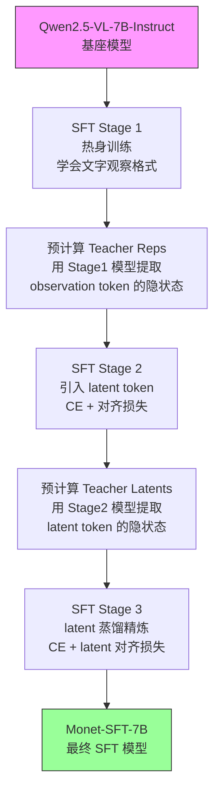
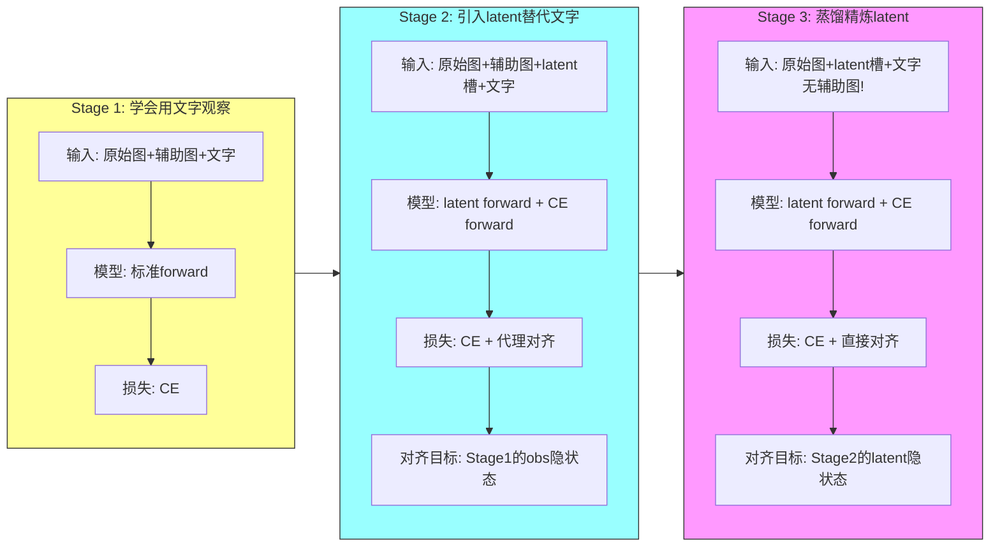

# Monet 模型 SFT 训练三步骤详解

> 本文档面向初学者，结合代码逐行逐模块讲解 Monet 模型的 SFT（Supervised Fine-Tuning）训练流程。
> Monet 是 CVPR 2026 论文 *"Monet: Reasoning in Latent Visual Space Beyond Images and Language"* 提出的训练框架，
> 让多模态大语言模型（MLLM）能在隐空间中用连续向量进行"视觉推理"，而不再依赖文字描述。

---

## 目录

- [1. 背景知识：为什么要分三个阶段？](#1-背景知识为什么要分三个阶段)
- [2. 项目代码结构总览](#2-项目代码结构总览)
- [3. 数据格式与特殊 Token](#3-数据格式与特殊-token)
- [4. SFT Stage 1：热身阶段](#4-sft-stage-1热身阶段)
- [5. SFT Stage 2：引入 Latent Token](#5-sft-stage-2引入-latent-token)
- [6. SFT Stage 3：Latent 蒸馏精炼](#6-sft-stage-3latent-蒸馏精炼)
- [7. 三阶段对比总结](#7-三阶段对比总结)
- [8. 关键概念答疑](#8-关键概念答疑)

---

## 1. 背景知识：为什么要分三个阶段？

### 1.1 Monet 的核心思想

传统 MLLM 的推理过程是这样的：

```
用户图片 + 问题 → 文字思考 → 文字回答
```

问题在于：**文字无法精确表达视觉信息**。比如"数图中有几个红点"这种任务，
你很难用文字描述清楚你看到了什么，再基于文字描述来做推理。

Monet 的创新是让模型用**连续向量（latent token）**代替文字来"思考"：

```
用户图片 + 问题 → latent 向量推理 → 文字回答
```

模型在推理过程中会生成一系列**latent 向量**（不对应任何文字 token），
这些向量直接编码了视觉观察信息，然后模型基于这些 latent 向量进行后续推理。

### 1.2 为什么不能一步到位？

如果直接让模型从零开始学 latent 推理，模型根本不知道 latent 向量应该编码什么信息。
就好比让一个不会说话的人突然开始用密码交流——他既不知道密码的含义，也不知道该传什么信息。

所以 Monet 采用了渐进式训练：

| 阶段 | 目标 | 模拟比喻 |
|------|------|----------|
| **Stage 1** | 先学会用文字描述观察 | 先学会说话 |
| **Stage 2** | 用 latent 向量替代文字，但保持语义一致 | 学会用密码替代说话，密码的含义和说话一样 |
| **Stage 3** | 进一步精炼 latent 向量的质量 | 优化密码的表达效率和精度 |

### 1.3 整体训练流程图



---

## 2. 项目代码结构总览

### 2.1 核心文件一览

| 文件路径 | 作用 | 关键内容 |
|----------|------|----------|
| `src/main.py` | 训练入口 | 数据加载、collate_fn 定义、Trainer 初始化、训练启动 |
| `src/trainer.py` | 自定义训练器 | 三个阶段的 `compute_loss` 实现（核心！） |
| `src/task.py` | 数据预处理 | 将原始数据转为对话格式，验证数据合法性 |
| `src/utils.py` | 工具函数 | 参数解析、特殊 token 定位、4D attention mask 构建、图像缩放 |
| `src/precompute_teacher_reps.py` | 预计算 teacher 隐状态 | Stage 1 → Stage 2 之间的中间步骤 |
| `src/precompute_teacher_latents.py` | 预计算 teacher latent 向量 | Stage 2 → Stage 3 之间的中间步骤 |
| `monet_qwen_model/modeling_qwen2_5_vl_monet.py` | 修改后的模型代码 | latent forward 机制、对齐损失计算、加权 CE 损失 |
| `monet_qwen_model/apply_qwen2_5_monet.py` | 猴子补丁 | 替换官方 Qwen2.5-VL 为 Monet 版本 |
| `script_examples/sft_stage1.sh` | Stage 1 启动脚本 | `torchrun` 命令和参数配置 |
| `script_examples/sft_stage2.sh` | Stage 2 启动脚本 | 包含预计算 + 训练两步 |
| `script_examples/sft_stage3.sh` | Stage 3 启动脚本 | 包含预计算 + 训练两步 |

### 2.2 代码执行流程

每个阶段的训练都遵循以下流程：

```
1. main.py 加载参数和数据
2. main.py 注册特殊 token，初始化模型和 processor
3. main.py 选择对应阶段的 collate_fn 和 Trainer
4. Trainer.train() 开始训练循环
5. 每个 training step：Trainer.compute_loss() 被调用
6. compute_loss() 内部调用 model.forward() 计算损失
7. 反向传播，更新参数
```

---

## 3. 数据格式与特殊 Token

### 3.1 Monet 引入的特殊 Token

在 `src/main.py` 中，模型注册了 5 个新的特殊 token：

```python
processor.tokenizer.add_tokens("<abs_vis_token_pad>", special_tokens=True)   # latent 占位符
processor.tokenizer.add_tokens("<abs_vis_token>", special_tokens=True)       # latent 开始标记
processor.tokenizer.add_tokens("</abs_vis_token>", special_tokens=True)      # latent 结束标记
processor.tokenizer.add_tokens("<observation>", special_tokens=True)          # 观察文字开始
processor.tokenizer.add_tokens("</observation>", special_tokens=True)         # 观察文字结束
```

各 token 的含义：

| Token | 含义 | 用途 |
|-------|------|------|
| `<abs_vis_token>` | latent 推理槽的**开始标记** | 标识"接下来是 latent 向量区域" |
| `</abs_vis_token>` | latent 推理槽的**结束标记** | 标识"latent 区域到此结束" |
| `<abs_vis_token_pad>` | latent 推理槽的**占位符** | latent_size 个 pad 组成 latent 推理段 |
| `<observation>` | 观察文字的**开始标记** | 标识"接下来是文字描述的观察内容" |
| `</observation>` | 观察文字的**结束标记** | 标识"文字观察内容到此结束" |

### 3.2 训练数据的对话格式

原始数据是多轮对话，格式如下（以一个数红点的样本为例）：

```json
{
  "data": [
    {
      "role": "system",
      "content": [{"type": "text", "text": "You are a helpful assistant."}]
    },
    {
      "role": "user",
      "content": [
        {"type": "image", "image": "red_dots.png"},
        {"type": "text", "text": "How many red dots are in the image?"}
      ]
    },
    {
      "role": "assistant",
      "content": [
        {"type": "text", "text": "<abs_vis_token></abs_vis_token>"},
        {"type": "image", "image": "red_dots_crop.png"},
        {"type": "text", "text": "<observation>I see 3 red dots clustered in the upper left.</observation>The answer is 3."}
      ]
    }
  ]
}
```

关键结构说明：
- 用户消息：包含原始图片 + 文字问题
- 助手消息：包含 `<abs_vis_token></abs_vis_token>`（latent 槽位）+ 辅助图片（裁剪/标注后的局部图）+ `<observation>`文字观察描述 + 最终答案

### 3.3 数据预处理（`src/task.py`）

`Monet_single_input_images_preprocess_function` 的职责：

1. **图片路径转换**：把相对路径转为绝对路径（拼接 `dataset_root`）
2. **合法性检查 1**：每张助手图片前面必须有 `<abs_vis_token></abs_vis_token>` 占位符
3. **合法性检查 2**：`<observation>` 标签之前必须有助手图片（先看图才能有观察结论）
4. **最终检查**：图片数量必须等于 `<abs_vis_token></abs_vis_token>` 占位符数量
5. **最终检查**：样本必须至少包含一个 `<observation>` 标签（否则训练没有意义）

不合格的样本会被 `return None` 过滤掉。

---

## 4. SFT Stage 1：热身阶段

### 4.1 目标

**让模型学会"先观察，再推理"的文字格式**。在这个阶段，模型直接用文字 token 进行完整的推理，
包括 `<observation>` 文字标注的观察部分。不涉及任何 latent 向量。

### 4.2 启动脚本（`script_examples/sft_stage1.sh`）

```bash
CE_EMPHASIZE_FACTOR=2.0
SAVE_CKPT=sft_stage1_ce${CE_EMPHASIZE_FACTOR}

torchrun --nproc-per-node=8 --master-port=29501 -m src.main \
  --epochs 4 \
  --bsz 1 \
  --grad_accum_steps 16 \
  --stage "sft_stage1" \
  --data_path \
    "path_to_your_dataset/Monet-SFT-125K/Visual_CoT/train.json" \
    "path_to_your_dataset/Monet-SFT-125K/CogCoM/train.json" \
    "path_to_your_dataset/Monet-SFT-125K/ReFocus/train.json" \
    "path_to_your_dataset/Monet-SFT-125K/Zebra_CoT_count/train.json" \
    "path_to_your_dataset/Monet-SFT-125K/Zebra_CoT_visual_search/train.json" \
    "path_to_your_dataset/Monet-SFT-125K/Zebra_CoT_geometry/train.json" \
  --load_model_path path_to_your_model/Qwen2.5-VL-7B-Instruct \
  --save_model_path path_to_your_model/Monet_checkpoints/sft_stage1/${SAVE_CKPT} \
  --dataset_root path_to_your_dataset/Monet-SFT-125K \
  --deepspeed ./deepspeed/ds_zero2_gpu.json \
  --swanlab_name ${SAVE_CKPT} \
  --ce_emphasize_factor ${CE_EMPHASIZE_FACTOR}
```

关键参数说明：

| 参数 | 值 | 含义 |
|------|----|------|
| `--stage` | `sft_stage1` | 指定使用 Stage 1 的训练逻辑 |
| `--epochs` | 4 | 训练 4 个 epoch |
| `--ce_emphasize_factor` | 2.0 | observation token 位置的 CE 损失放大 2 倍 |
| `--load_model_path` | Qwen2.5-VL-7B-Instruct | 从原始 Qwen2.5-VL 模型开始训练 |

### 4.3 Collate 函数（`collate_fn_sft_stage1`）

`collate_fn_sft_stage1` 在 `src/main.py` 中定义，负责把一批数据样本转换为模型可以处理的 batch tensor。

**关键步骤：**

#### 步骤 1：文字处理——替换 latent 占位符为图片 token

```python
texts = [replace_latent_placeholder_with_img_pad(text) for text in texts]
```

原始对话中 `<abs_vis_token></abs_vis_token>` 是 latent 推理的占位符。
在 Stage 1 中模型不使用 latent，所以把它替换成标准的图片标记 `<|vision_start|><|image_pad|><|vision_end|>`。

**替换逻辑**（`src/utils.py` 中的 `replace_latent_placeholder_with_img_pad`）：
- 在 assistant 回复部分，找到 `<abs_vis_token></abs_vis_token>` 
- 把该位置的 `<|vision_start|><|image_pad|><|vision_end|>`（已经存在的外层图片标记）删掉
- 然后把 `<abs_vis_token></abs_vis_token>` 替换为 `<|vision_start|><|image_pad|><|vision_end|>`

这样 Stage 1 的模型看到的就是：**原始图片 + 辅助图片 + 文字观察 + 文字回答**——完整的文字推理链。

#### 步骤 2：生成 teacher batch

```python
image_inputs, _ = process_vision_info(examples)
teacher_texts = texts
teacher_batch = processor(text=teacher_texts, images=image_inputs, return_tensors="pt", padding=True)
```

把处理后的文字和图片一起送入 `processor`，生成标准的输入 tensor。

#### 步骤 3：定位 observation token 位置

```python
observation_start_poss = find_ids_poss(batch["teacher_input_ids"], answer_start_pattern, observation_start_idx)
observation_end_poss = find_ids_poss(batch["teacher_input_ids"], answer_start_pattern, observation_end_idx)
batch["teacher_observation_poss"] = []
for start_poss, end_poss in zip(observation_start_poss, observation_end_poss):
    poss_of_a_sample = []
    for start, end in zip(start_poss, end_poss):
        poss_of_a_sample.extend(list(range(start, end)))
    batch["teacher_observation_poss"].append(poss_of_a_sample)
```

`<observation>` 和 `</observation>` 之间的所有 token 位置被标记为 "observation 位置"，
这些位置在计算 CE 损失时会被加权放大。

#### 步骤 4：生成 labels

```python
batch["teacher_labels"] = generate_labels_after_multi_token_start(
    batch["teacher_input_ids"], 
    answer_start_pattern, 
    ignore_ids=[..., observation_start_idx, observation_end_idx]
)
```

`generate_labels_after_multi_token_start` 的逻辑：
- 找到 `<|im_start|>assistant` 的位置
- 把**该位置之前的所有 token 的 label 设为 -100**（不计算损失）
- **该位置之后的 token 保留原始 ID**作为预测目标
- 特殊 token（如 `<observation>`, `</observation>`, `<|image_pad|>` 等）的 label 也设为 -100

这意味着：**模型只需要学习预测 assistant 回复中的有意义文字**，
不需要预测图片标记、observation 标签等辅助 token。

### 4.4 Trainer（`CustomTrainerSFT_STAGE1`）

在 `src/trainer.py` 中定义，继承 `trl.SFTTrainer`，重写 `compute_loss` 方法。

#### compute_loss 的核心逻辑

```python
def compute_loss(self, model, inputs, return_outputs=False, num_items_in_batch=None):
    # 1. 关闭 latent 模式（标准前向传播）
    inputs['latent_mode'] = False
    
    # 2. 使用 teacher 数据（含文字 observation）
    inputs['input_ids'] = inputs['teacher_input_ids']
    inputs['attention_mask'] = inputs['teacher_attention_mask']
    inputs['pixel_values'] = inputs['teacher_pixel_values']
    inputs['image_grid_thw'] = inputs['teacher_image_grid_thw']
    inputs['labels'] = inputs['teacher_labels']
    
    # 3. 指定 observation token 位置的加权
    inputs['ce_emphasize_poss'] = inputs['teacher_observation_poss']
    inputs['ce_emphasize_factor'] = self.args.ce_emphasize_factor  # 通常 2.0
    
    # 4. 只计算 CE 损失
    inputs['loss_type'] = ['ce']
    
    # 5. 调用模型前向传播
    (teacher_ce_loss, teacher_outputs) = super().compute_loss(model, inputs, return_outputs=True)
    
    return teacher_ce_loss
```

**Stage 1 的损失只有 CE（交叉熵）**：

$$Loss = \frac{1}{N_{valid}} \sum_{i} w_i \cdot CE(p_i, y_i)$$

其中：
- $w_i$：对 observation 位置，$w_i = ce\_emphasize\_factor$（如 2.0），其他位置 $w_i = 1.0$
- $p_i$：模型对位置 $i$ 的预测概率
- $y_i$：位置 $i$ 的目标 token
- $N_{valid}$：有效 token（label 非 -100）的总权重数

加权 observation 位置的意义：**让模型更重视学会预测观察内容**，因为观察是 Stage 2 被替换成 latent 的关键部分。

### 4.5 Stage 1 数据流示意

```
原始数据:
  用户: [图片] "数红点"
  助手: <abs_vis_token></abs_vis_token> [局部图] <observation>看到3个红点</observation> 答案是3

Stage 1 替换后:
  用户: [图片] "数红点"
  助手: [局部图] <observation>看到3个红点</observation> 答案是3
  
模型预测目标 (labels):
  [忽略] ... [忽略] <|im_start|>assistant [忽略局部图] [忽略<observation>] 看到3个红点 [忽略</observation>] 答案是3
  
CE 损失:
  - "看到3个红点" 位置权重 × 2.0  ← observation 内容，重点学
  - "答案是3" 位置权重 × 1.0
```

---

## 5. SFT Stage 2：引入 Latent Token

### 5.1 目标

**用 latent 向量替代文字 observation，同时让 latent 向量的语义与 Stage 1 模型的 observation 隐状态对齐**。

这一步是最复杂的，因为模型需要同时学习两件事：
1. 生成正确的 latent 向量（代替文字观察）
2. 让这些 latent 向量的内部表示和 Stage 1 模型的文字观察表示语义一致

### 5.2 前置步骤：预计算 Teacher Reps

在开始 Stage 2 训练之前，需要先用 **Stage 1 的模型** 预计算 observation token 的隐状态。

#### 启动脚本（`script_examples/sft_stage2.sh` 第1步）

```bash
TEACHER=sft_stage1_ce2.0

torchrun --nproc-per-node=8 --master-port=29505 -m src.precompute_teacher_reps \
  --data_path ... \
  --load_model_path path_to_your_model/Monet_checkpoints/sft_stage1/${TEACHER} \
  --save_model_path path_to_your_model/Monet_checkpoints/monet_precomputed_observation_token_teacher_reps/${TEACHER} \
  --dataset_root path_to_your_dataset \
  --deepspeed ./deepspeed/ds_zero2_gpu.json \
  --output_hidden_states \
  --alignment_layer all_layers
```

#### 预计算逻辑（`src/precompute_teacher_reps.py`）

核心流程：

1. 加载 Stage 1 模型（设置为 `eval` 模式，冻结视觉编码器）
2. 遍历训练数据，用 Stage 1 模型做标准前向传播（`latent_mode=False`）
3. 提取 `<observation>` 到 `</observation>` 之间所有 token 在**所有层的隐状态**
4. 保存到磁盘，文件名格式为 `rep_all_layers_{dataset_name}_{sample_id}.pt`

```python
# 在 precompute_teacher_reps.py 中
inputs = {
    'latent_mode': False,    # 标准前向传播（不含 latent）
    'input_ids': batch['teacher_input_ids'].to(device),
    'attention_mask': batch['teacher_attention_mask'].to(device),
    'pixel_values': batch['teacher_pixel_values'].to(device),
    ...
    'alignment_poss': alignment_poss,   # observation token 位置
    'loss_type': [],                    # 不计算损失
}
outputs = model(**inputs, return_dict=True)
teacher_reps = outputs.hidden_states    # 所有层的隐状态
# 保存到磁盘
torch.save({'latent': teacher_reps[b].detach().cpu()}, save_path)
```

**为什么需要预计算？**
- Stage 1 模型在训练过程中是固定的（不参与 Stage 2 的梯度更新）
- 每个 observation token 的隐状态可以提前算好，训练时直接从磁盘加载
- 这样 Stage 2 训练时不需要同时运行两个模型，节省显存和计算时间

### 5.3 Stage 2 训练脚本（`script_examples/sft_stage2.sh` 第2步）

```bash
LATENT_SIZE=8
CE_EMPHASIZE_FACTOR=4.0
ALIGNMENT_WEIGHT=2.0
EMPHASIZE_LATENT_WEIGHT=2.0

torchrun --nproc-per-node=8 --master-port=29501 -m src.main \
  --epochs 2 \
  --stage "sft_stage2" \
  --latent_size ${LATENT_SIZE} \
  --alignment_weight ${ALIGNMENT_WEIGHT} \
  --ce_emphasize_factor ${CE_EMPHASIZE_FACTOR} \
  --emphasize_latent_weight ${EMPHASIZE_LATENT_WEIGHT} \
  --teacher_reps_dir path_to_your_model/Monet_checkpoints/monet_precomputed_observation_token_teacher_reps/${TEACHER} \
  --alignment_layer all_layers \
  ...
```

关键新增参数：

| 参数 | 值 | 含义 |
|------|----|------|
| `--latent_size` | 8 | 每个 latent 推理槽包含 8 个 `<abs_vis_token_pad>` token |
| `--alignment_weight` | 2.0 | 对齐损失的权重系数 |
| `--emphasize_latent_weight` | 2.0 | 代理梯度损失的权重（让对齐梯度只流经 latent 向量） |
| `--teacher_reps_dir` | ... | Stage 1 预计算的 observation 隐状态目录 |

### 5.4 Collate 函数（`collate_fn_sft_stage2`）

Stage 2 的数据格式与 Stage 1 有本质区别。

#### 关键步骤 1：保留辅助图片 + 在其后面插入 latent 推理槽

```python
texts = [replace_latent_placeholder_with_img_pad(text) for text in texts]
texts = add_latent_pad_after_auxiliary_img(texts, args.latent_size, "<abs_vis_token_pad>")
```

**`replace_latent_placeholder_with_img_pad`**：把 `<abs_vis_token></abs_vis_token>` 替换为辅助图片标记（同 Stage 1）。

**`add_latent_pad_after_auxiliary_img`**：在辅助图片标记**之后**追加 latent 推理槽。

处理后的文字格式：

```
<|im_start|>assistant <|vision_start|><|image_pad|><|vision_end|><abs_vis_token><abs_vis_token_pad>...<abs_vis_token_pad></abs_vis_token><observation>...</observation> 答案文字
```

即：**辅助图片 → latent 推理槽 → observation 文字 → 答案**

与 Stage 1 的区别：
- Stage 1：`辅助图片 → observation 文字 → 答案`
- Stage 2：`辅助图片 → latent 推理槽 → observation 文字 → 答案`

latent 推理槽的存在使得模型可以在 latent 模式下自回归地生成 latent 向量。

#### 关键步骤 2：构建 4D Attention Mask

```python
attn_mask_4d, _ = build_4d_attn(
    input_ids=batch["input_ids"],
    pad_mask=batch["attention_mask"],
    token_ids=SPECIAL_id,
    ...
)
```

Stage 2 需要特殊的注意力规则，因为序列中同时存在：
- 图片 token（I_i）：辅助图片的视觉特征
- latent token（A_i）：latent 推理槽的占位符
- observation token（O_i）：文字观察内容
- 普通 text token：其他文字

`build_4d_attn` 构建的注意力规则（在 `src/utils.py` 中）：

| Token 类型 | 能看到什么 | 为什么 |
|-----------|-----------|--------|
| Latent A_i | 它对应的图片 I_i + 所有之前的 token + 自身下三角 | latent 需要看到对应的辅助图片来"理解"视觉信息 |
| 图片 I_i | 只被对应的 A_i 看到 | 避免后续 token 直接"偷看"辅助图片，强迫通过 latent 中转 |
| Observation O_i | causal + 之前 latent | 观察推理结果需要参考 latent 信息 |

#### 关键步骤 3：生成 labels

```python
batch["labels"] = generate_labels_after_multi_token_start(
    batch["input_ids"], answer_start_pattern, 
    ignore_ids=[..., latent_pad_idx, latent_end_idx, observation_start_idx, observation_end_idx]
)
```

注意：latent 推理槽的占位符（`<abs_vis_token_pad>`, `</abs_vis_token>`）和 observation 标签都被设为 -100，
**模型不需要直接预测这些 token**——latent 是通过特殊的前向传播机制生成的。

### 5.5 Trainer（`CustomTrainerSFT_STAGE2`）

Stage 2 的 `compute_loss` 是整个训练流程中最复杂的部分，采用了**两步前向传播**策略。

#### 为什么需要两步 forward？

Latent token 的生成过程与普通文字 token 完全不同：

- **普通文字**：模型看到前面的所有 token，一步预测下一个 token
- **Latent token**：每个 latent token 需要单独一步 forward，因为它的输入是**前一个 latent token 的隐状态**而非文字 token

所以需要：
- **第1步**：`latent_mode=True` 的前向传播，自回归地逐个生成 latent 向量
- **第2步**：`latent_mode=False` 的前向传播，把生成的 latent 向量插入序列中，做标准计算

#### compute_loss 的完整逻辑

```python
def compute_loss(self, model, inputs, return_outputs=False, num_items_in_batch=None):
    
    # ===== 第1步：latent forward =====
    # 目的：自回归生成每个 latent token 的向量
    
    inputs['latent_mode'] = True      # 开启 latent 模式
    inputs['loss_type'] = []           # 不计算任何损失
    
    # 必须禁用 gradient checkpointing（与 KV Cache 不兼容）
    model.gradient_checkpointing_disable()
    
    # 执行 latent 前向传播
    outputs = model(**inputs, return_dict=True, output_hidden_states=False)
    
    # outputs.ce_patch_pos：每个 latent token 在序列中的位置列表
    # outputs.ce_patch_vec：每个 latent token 的向量值（用于第2步注入）
    
    # ===== 第2步：CE forward =====
    # 目的：把 latent 向量插入序列，计算 CE + 对齐损失
    
    # 重新开启 gradient checkpointing（节省显存）
    model.gradient_checkpointing_enable(gradient_checkpointing_kwargs={"use_reentrant": False})
    
    inputs['latent_mode'] = False     # 关闭 latent 模式
    inputs['ce_patch_pos'] = outputs.ce_patch_pos   # latent 位置
    inputs['ce_patch_vec'] = outputs.ce_patch_vec   # latent 向量
    inputs['ce_emphasize_poss'] = inputs['observation_poss']  # observation 加权位置
    inputs['ce_emphasize_factor'] = self.ce_emphasize_factor
    inputs['loss_type'] = ['ce']
    if self.args.alignment_weight != 0:
        inputs['loss_type'].append('alignment')
    
    # 加载预计算的 teacher observation 隐状态
    if self.args.alignment_weight != 0:
        teacher_reps = load_offline_tensor(
            self.args.teacher_reps_dir,
            batch_metadata=inputs['metadata'],
            alignment_layer=self.args.alignment_layer
        )
        inputs['alignment_poss'] = inputs['observation_poss']
        inputs['teacher_hidden_states_for_alignment'] = teacher_reps
    
    # 执行第2步前向传播
    (teacher_ce_loss, teacher_output) = super().compute_loss(model, inputs, return_outputs=True)
    
    # 取出对齐损失
    alignment_loss = teacher_output.loss_dict.get('alignment', torch.tensor(0.0))
    
    # ===== 计算最终总损失 =====
    if self.args.emphasize_latent_weight != 0.0 and alignment_loss.item() != 0.0:
        # 方式一（推荐）：代理梯度技巧
        # 让对齐损失的梯度只流经 latent 向量，不流经模型参数
        latent_only_loss = compute_latents_only_loss(
            outputs.ce_patch_vec,
            self.args.alignment_weight * alignment_loss
        )
        loss = self.args.emphasize_latent_weight * latent_only_loss + teacher_ce_loss
    else:
        # 方式二（简单）：直接相加
        loss = teacher_ce_loss + self.args.alignment_weight * alignment_loss
    
    return loss
```

### 5.6 Latent Forward 的内部机制

在 `monet_qwen_model/modeling_qwen2_5_vl_monet.py` 的 `Qwen2_5_VLModel.forward` 中，
当 `latent_mode=True` 时，模型执行分段前向传播：

```
序列：[问题图片...问题文字...|辅助图片...latent_pad...latent_pad...latent_pad...|observation文字...|答案文字...]
       ↑ pre-answer 段        ↑ 每个latent token 单步forward ↑ text段      ↑text段
```

具体流程（以一个样本为例）：

1. **Forward pre-answer 段**：从序列开始到 `<|im_start|>assistant` 之前的所有 token
   - 这部分是"上下文"（用户图片+问题），做一步标准 forward，获取 KV Cache
   
2. **逐个 forward latent token**：
   - 对每个 `<abs_vis_token_pad>` 位置：
     - 输入：**前一个 token 的隐状态**（而非文字 embedding）
     - 单步 forward，获取该 latent token 的隐状态
     - 更新 KV Cache
     - 记录 `ce_patch_pos` 和 `ce_patch_vec`
   
3. **Forward 非 latent 段**：latent token 之间的文字和图片 token
   - 图片 token 使用 `no_grad`（不影响梯度）
   - observation token 位置计算**对齐损失**（与 teacher 隐状态对比）

### 5.7 代理梯度技巧（`compute_latents_only_loss`）

这是 Stage 2 中的一个关键工程技巧。

**问题**：对齐损失需要优化 latent 向量的方向，但如果对齐损失的梯度直接传给模型的线性层参数，
会干扰 CE 损失的优化方向——模型参数被两种不同目标的梯度"拉扯"。

**解决方案**：构造一个"代理损失"，让对齐损失的梯度**只到达 latent 向量这一层**，不继续向前传播。

```python
def compute_latents_only_loss(latents, loss_for_latents):
    # 1. 手动计算对齐损失对 latent 向量的梯度
    grads = torch.autograd.grad(
        outputs=loss_for_latents,
        inputs=ce_vec_list,
        retain_graph=True,
        create_graph=False,
        allow_unused=True
    )
    
    # 2. detach 梯度（切断向前传播链）
    safe_grads = [g.detach() for g in grads]
    
    # 3. 构造代理损失：sum(latent × grad.detach())
    proxy_loss = torch.stack([(v * g).sum() for v, g in zip(ce_vec_list, safe_grads)]).sum()
    return proxy_loss
```

**数学原理**：

设 $L_{align}$ 为对齐损失，$v$ 为 latent 向量，$\theta$ 为模型参数。

直接反向传播：$\frac{\partial L_{align}}{\partial \theta} = \frac{\partial L_{align}}{\partial v} \cdot \frac{\partial v}{\partial \theta}$

代理梯度：$L_{proxy} = \sum_i v_i \cdot \frac{\partial L_{align}}{\partial v_i}|_{detach}$

反向传播 $L_{proxy}$：$\frac{\partial L_{proxy}}{\partial \theta} = \frac{\partial L_{proxy}}{\partial v_i} \cdot \frac{\partial v_i}{\partial \theta}$

但 $\frac{\partial L_{proxy}}{\partial v_i} = \frac{\partial L_{align}}{\partial v_i}|_{detach}$ 是一个常数（已 detach），
所以 $\frac{\partial L_{proxy}}{\partial v_i}$ 的梯度会正确地传到 latent 向量，
但不会再往前传给 $\theta$（因为 $v_i$ 的生成过程不参与 $L_{proxy}$ 的梯度计算）。

### 5.8 对齐损失（`alignment_loss`）

对齐损失使用**余弦相似度**度量 student 和 teacher 隐状态的语义接近程度：

```python
def alignment_loss(teacher_hidden_states, student_hidden_states):
    if teacher_hidden_states.dim() == 3:  # 对齐所有层
        total_loss = (1 - F.cosine_similarity(teacher, student)).mean()
    elif teacher_hidden_states.dim() == 1:  # 对齐最后一层
        total_loss = 1 - F.cosine_similarity(student, teacher, 0)
    return total_loss
```

**`alignment_layer=all_layers`** 时，对齐所有 Transformer 层的隐状态，
这样 latent 向量不仅在最终输出层与 teacher 一致，在中间每一层也保持语义对齐。

### 5.9 Stage 2 数据流示意

```
第1步 (latent forward):
  输入序列: [问题图片...问题文字...|辅助图片...<latent_pad>...<latent_pad>...<latent_pad>...|observation文字...|答案]
  
  1a. Forward pre-answer → 获得 KV Cache
  1b. 逐个 forward latent token → 每个latent的输入是前一步的隐状态
      latent_1 输入 = pre-answer 最后一个 token 的隐状态
      latent_2 输入 = latent_1 的隐状态
      latent_3 输入 = latent_2 的隐状态
      ...
  1c. 记录 ce_patch_pos=[latent位置列表], ce_patch_vec=[latent向量列表]

第2步 (CE forward):
  把 latent 向量注入序列中对应位置（替代 <abs_vis_token_pad> 的 embedding）
  前向传播计算 logits → CE 损失
  同时在 observation 位置计算对齐损失（与 Stage1 的 observation 隐状态对比）

最终损失:
  loss = emphasize_latent_weight × proxy_alignment_loss + ce_loss
  或
  loss = ce_loss + alignment_weight × alignment_loss
```

---

## 6. SFT Stage 3：Latent 蒩馏精炼

### 6.1 目标

**进一步精炼 latent 向量的质量，让 Stage 3 模型的 latent 向量向 Stage 2 模型生成的 "教师 latent 向量" 对齐**。

与 Stage 2 的关键区别：
- Stage 2 对齐的是 **observation token（文字）的隐状态**（从 Stage 1 模型预计算）
- Stage 3 对齐的是 **latent token 本身的隐状态**（从 Stage 2 模型预计算）

这意味着 Stage 3 的对齐更加直接——不再跟文字对比，而是直接跟"已经学会 latent 推理的 teacher 模型"的 latent 向量对比。

### 6.2 前置步骤：预计算 Teacher Latents

#### 启动脚本（`script_examples/sft_stage3.sh` 第1步）

```bash
TEACHER=sft_stage2_latent8_ce4.0_al2.0_emph2.0

torchrun --nproc-per-node=8 --master-port=29501 -m src.precompute_teacher_latents \
  --load_model_path path_to_your_model/Monet_checkpoints/sft_stage2/${TEACHER} \
  --save_model_path path_to_your_model/Monet_checkpoints/monet_precomputed_target_latent/${TEACHER} \
  --latent_size ${TEACHER_LATENT_SIZE} \
  --output_hidden_states \
  --resume
```

#### 预计算逻辑（`src/precompute_teacher_latents.py`）

与预计算 teacher reps 不同，这里使用 **latent_mode=True** 前向传播：

```python
inputs = {
    'latent_mode': True,      # ← 关键区别！用 latent 模式
    'input_ids': batch['input_ids'].to(device),
    'attention_mask': batch['attention_mask'].to(device),
    'pixel_values': batch['pixel_values'].to(device),
    ...
    'loss_type': [],          # 不计算损失
}
outputs = model(**inputs, return_dict=True)
teacher_reps = outputs.hidden_states    # latent token 在所有层的隐状态
```

保存文件名格式为 `latent_all_layers_{dataset_name}_{sample_id}.pt`。

### 6.3 Stage 3 训练脚本

```bash
torchrun --nproc-per-node=8 --master-port=29501 -m src.main \
  --stage "avt_v5_stage2" \   # ← 注意：Stage 3 的 stage 名是 avt_v5_stage2
  --latent_size 8 \
  --alignment_weight 2.0 \
  --ce_emphasize_factor 4.0 \
  --teacher_latent_dir path_to_your_model/Monet_checkpoints/monet_precomputed_target_latent/${TEACHER} \
  --alignment_layer all_layers \
  ...
```

### 6.4 Collate 函数（`collate_fn_sft_stage3`）

Stage 3 的数据格式又有新的变化。

#### 关键步骤 1：student 数据——替换辅助图片为 latent 推理槽

```python
student_texts = replace_img_pad_with_latent_pad(texts, args.latent_size, "<abs_vis_token_pad>")
user_examples = remove_auxiliary_images(examples)
user_image_inputs, _ = process_vision_info(user_examples)
```

**`replace_img_pad_with_latent_pad`**：在 assistant 回复部分，
把 `<|vision_start|><|image_pad|><|vision_end|>` 替换为 `<abs_vis_token><abs_vis_token_pad>...<abs_vis_token_pad></abs_vis_token>`。

**`remove_auxiliary_images`**：从对话中移除 assistant 的辅助图片（只保留用户的原始图片）。

**这意味着 Stage 3 的 student 数据中不再有辅助图片**！latent 推理槽替代了辅助图片的位置。

Stage 3 student 数据格式：

```
用户: [原始图片] "数红点"
助手: <abs_vis_token><latent_pad>...<latent_pad></abs_vis_token> <observation>看到3个红点</observation> 答案是3
```

注意：没有辅助图片了！模型需要完全依靠 latent 推理来获取视觉信息。

#### 关键步骤 2：构建 student 的 4D attention mask（不含辅助图片）

```python
if args.mask_latent:
    attn_mask_4d = build_4d_attn_wo_helper_images(
        input_ids=batch["student_input_ids"],
        pad_mask=batch["student_attention_mask"],
        token_ids=SPECIAL_id,
        mask_latent=True,
    )
```

因为没有辅助图片，注意力规则更简单：
- latent token 不可见给后续 token（`mask_latent=True`）
- 其他遵循标准 causal mask

### 6.5 Trainer（`CustomTrainerSFT_STAGE3`）

Stage 3 也采用两步前向传播，但与 Stage 2 有几个重要区别。

#### compute_loss 的核心逻辑

```python
def compute_loss(self, model, inputs, return_outputs=False, num_items_in_batch=None):
    
    # ===== 加载 Stage 2 预计算的 teacher latent =====
    teacher_latents = load_offline_tensor(
        self.teacher_latent_dir,
        batch_metadata=inputs['metadata'],
        alignment_layer=self.args.alignment_layer,
        rep_type="latent"    # ← 关键区别：加载的是 latent 向量，不是 observation 隐状态
    )
    
    # ===== 第1步：student latent forward =====
    inputs['latent_mode'] = True
    inputs['input_ids'] = inputs['student_input_ids']    # ← 使用 student 数据
    inputs['pixel_values'] = inputs['student_pixel_values']
    
    # 传入 teacher latent（用于 latent forward 内部计算对齐损失）
    inputs['alignment_poss'] = inputs['student_alignment_poss']
    inputs['teacher_hidden_states_for_alignment'] = teacher_latents
    
    model.gradient_checkpointing_disable()
    inputs['loss_type'] = []   # 不计算损失
    
    student_outputs_latent = model(**inputs)
    
    # ===== 第2步：student CE forward =====
    inputs['latent_mode'] = False
    inputs['labels'] = inputs['student_labels']
    inputs['ce_patch_pos'] = student_outputs_latent.ce_patch_pos
    inputs['ce_patch_vec'] = student_outputs_latent.ce_patch_vec
    
    model.gradient_checkpointing_enable(gradient_checkpointing_kwargs={"use_reentrant": False})
    inputs['loss_type'] = ['ce', 'alignment']   # ← 同时计算 CE 和对齐损失
    
    (student_ce_loss, student_outputs) = super().compute_loss(model, inputs, return_outputs=True)
    
    alignment_loss = student_outputs.loss_dict['alignment']
    
    # ===== 最终损失 =====
    loss = student_ce_loss + self.alignment_weight * alignment_loss
    # ← 注意：Stage 3 没有使用代理梯度技巧，直接相加
    
    return loss
```

#### Stage 3 与 Stage 2 的关键区别

| 区别点 | Stage 2 | Stage 3 |
|--------|---------|---------|
| 对齐目标 | Stage 1 的 observation 隐状态 | Stage 2 的 latent token 隐状态 |
| 对齐位置 | observation token 位置 | latent token 位置 |
| 预计算文件名 | `rep_*.pt` | `latent_*.pt` |
| 数据来源 | teacher 数据（含辅助图片+文字） | student 数据（只有原始图片+latent） |
| 对齐梯度策略 | 代理梯度技巧（只流经 latent） | 直接相加（梯度流经所有参数） |
| 辅助图片 | 存在 | 移除 |

### 6.6 Stage 3 数据流示意

```
第1步 (latent forward):
  输入序列: [原始图片...问题文字...|<latent_pad>...<latent_pad>...<latent_pad>...|observation文字...|答案]
  
  没有 auxiliary 图片！latent 推理槽直接替代了图片位置
  
  1a. Forward pre-answer → 获得 KV Cache
  1b. 逐个 forward latent token
      同时在每个 latent 位置计算对齐损失（与 Stage2 的 latent 隐状态对比）
  1c. 记录 ce_patch_pos 和 ce_patch_vec

第2步 (CE forward):
  把 latent 向量注入序列
  前向传播 → CE 损失 + 对齐损失（在 latent/observation 位置）

最终损失:
  loss = student_ce_loss + alignment_weight × alignment_loss
```

---

## 7. 三阶段对比总结

### 7.1 训练参数对比

| 参数 | Stage 1 | Stage 2 | Stage 3 |
|------|---------|---------|---------|
| `stage` | `sft_stage1` | `sft_stage2` | `avt_v5_stage2` |
| `epochs` | 4 | 2 | 2 |
| `ce_emphasize_factor` | 2.0 | 4.0 | 4.0 |
| `latent_size` | - | 8 | 8 |
| `alignment_weight` | - | 2.0 | 2.0 |
| `emphasize_latent_weight` | - | 2.0 | - |
| `teacher_reps_dir` | - | Stage 1 的 obs reps | - |
| `teacher_latent_dir` | - | - | Stage 2 的 latent reps |

### 7.2 模型输入对比

| 方面 | Stage 1 | Stage 2 | Stage 3 |
|------|---------|---------|---------|
| 图片 | 原始图片 + 辅助图片 | 原始图片 + 辅助图片 | 只有原始图片 |
| latent 推理槽 | 不存在 | 辅助图片后面 | 替代辅助图片 |
| observation 文字 | 存在（加权学习） | 存在（加权学习） | 存在（加权学习） |
| latent_mode | False | True → False（两步） | True → False（两步） |

### 7.3 损失函数对比

| 损失 | Stage 1 | Stage 2 | Stage 3 |
|------|---------|---------|---------|
| CE 损失 | 有（observation 加权） | 有（observation 加权） | 有（observation 加权） |
| 对齐损失 | 无 | 有（vs Stage1 obs 隐状态） | 有（vs Stage2 latent 隐状态） |
| 对齐梯度策略 | - | 代理梯度（只流经 latent） | 直接相加 |
| 最终损失公式 | $CE$ | $emph_w \cdot proxy\_align + CE$ | $CE + align_w \cdot align$ |

### 7.4 逐步演进图



---

## 8. 关键概念答疑

### Q1: 为什么 Stage 1 的 `ce_emphasize_factor` 是 2.0，Stage 2/3 变成了 4.0？

Stage 1 是热身阶段，模型刚开始学习观察格式，放大倍数不需要太大。
到了 Stage 2/3，observation 内容要被 latent 替代，需要模型对 observation 有更强的预测能力，
否则对齐目标的质量会下降。所以加大权重让模型更重视学会 observation 的内容。

### Q2: 为什么 Stage 2 用代理梯度技巧，Stage 3 不用？

Stage 2 的对齐目标（observation 隐状态）和模型当前的数据格式有本质不同：
- Teacher 用文字做推理（Stage 1 模型）
- Student 用 latent 做推理（Stage 2 模型）

如果对齐损失的梯度直接传给模型参数，会"拉扯"模型往文字推理方向优化，
干扰 latent 推理的学习。代理梯度技巧让对齐梯度只影响 latent 向量本身。

Stage 3 的对齐目标（Stage 2 的 latent 隐状态）和模型当前的数据格式一致：
都是 latent 推理。所以对齐损失和 CE 损失的优化方向一致，不需要代理梯度。

### Q3: 为什么 Stage 3 移除了辅助图片？

辅助图片在训练中的作用是给模型提供额外的视觉线索（裁剪、标注的局部图）。
但推理时模型不会有辅助图片——它需要**自己生成 latent 向量来"创造"视觉推理**。

Stage 2 还保留辅助图片是为了降低学习难度（有图片作为 bridge）。
Stage 3 移除辅助图片是为了让模型真正学会**纯 latent 推理**。

### Q4: `latent_mode=True` 的前向传播为什么那么复杂？

因为 latent token 的生成方式与文字 token 完全不同：

**文字 token**：模型一步 forward 所有 token，每个 token 的输入就是它在序列中的 embedding。

**Latent token**：每个 latent token 的输入是**前一个 token 的隐状态**（不是固定 embedding）。
而且前一个 token 可能也是 latent，所以必须自回归地逐个 forward。

这就像模型在"思考"——每一步的思考结果取决于上一步的思考结果。

代码中 `Qwen2_5_VLModel.forward` 的 `latent_mode` 实现就是分段 forward：
1. 先 forward pre-answer 段（获取 KV Cache）
2. 对每个 latent token 单步 forward（用 KV Cache 加速）
3. Forward latent 之间的 text/image 段

### Q5: 为什么预计算要在训练之前单独做？

两个原因：

1. **节省显存**：如果训练时同时运行 teacher 模型和 student 模型，显存会翻倍。
   预计算把 teacher 的输出存到磁盘，训练时只需从磁盘加载。

2. **效率**：teacher 模型是固定的，它的输出对所有 epoch 都是一样的。
   预计算一次就够了，不用每个 training step 都重新计算。

### Q6: DeepSpeed ZeRO-2 是什么？为什么训练脚本要用它？

DeepSpeed ZeRO-2 是一种分布式训练优化技术：
- 把模型参数、梯度分片到不同的 GPU 上
- 每个 GPU 只保存一部分参数，减少显存占用
- 在需要时通过通信收集完整参数

Monet 训练使用 7B 模型（约 14GB 参数），加上 latent forward 的额外显存开销，
单 GPU 显存不够，所以需要 ZeRO-2 和多卡训练（`--nproc-per-node=8`）。

### Q7: `load_offline_tensor` 是怎么工作的？

```python
def load_offline_tensor(tensor_dir, batch_metadata, alignment_layer, rep_type, align_poss):
    teacher_reps = []
    for metadata in batch_metadata:
        dataset_name = metadata['dataset_name']
        sample_id = metadata['sample_id']
        # 拼接文件名
        metadata_info = f"{alignment_layer}_{dataset_name}_{sample_id}"
        metadata_str = f"{rep_type}_{metadata_info}.pt"  # 或 f"{rep_type}_latent_end_{metadata_info}.pt"
        path = os.path.join(tensor_dir, metadata_str)
        data = torch.load(path, map_location='cpu')
        teacher_reps.append(data['latent'].detach())
    return teacher_reps
```

每个训练样本都有唯一的 `dataset_name` + `sample_id`，
预计算时用这个 ID 作为文件名，训练时也用同样的 ID 加载对应的 teacher 表示。

### Q8: Gradient Checkpointing 为什么在 latent forward 时必须禁用？

Gradient checkpointing 的原理是：在前向传播时不保存中间激活值，
反向传播时重新计算需要的激活值，以此节省显存。

但 latent forward 使用了 KV Cache（`use_cache=True`），KV Cache 是在前向传播中逐步构建的，
如果用 gradient checkpointing 重新前向传播，KV Cache 会被重建，导致逻辑错误。

所以 latent forward 时必须禁用 gradient checkpointing，
第二步的 CE forward（不需要 KV Cache）可以重新开启。

---

## 附录：代码文件索引

| 概念 | 代码位置 |
|------|---------|
| Stage 1 损失计算 | `src/trainer.py` → `CustomTrainerSFT_STAGE1.compute_loss` (L209-265) |
| Stage 2 损失计算 | `src/trainer.py` → `CustomTrainerSFT_STAGE2.compute_loss` (L339-456) |
| Stage 3 损失计算 | `src/trainer.py` → `CustomTrainerSFT_STAGE3.compute_loss` (L534-651) |
| 代理梯度技巧 | `src/trainer.py` → `compute_latents_only_loss` (L38-107) |
| Teacher 隐状态加载 | `src/trainer.py` → `load_offline_tensor` (L110-173) |
| Stage 1 collate | `src/main.py` → `collate_fn_sft_stage1` (L138-180) |
| Stage 2 collate | `src/main.py` → `collate_fn_sft_stage2` (L182-245) |
| Stage 3 collate | `src/main.py` → `collate_fn_sft_stage3` (L247-317) |
| Latent 模式前向传播 | `monet_qwen_model/modeling_qwen2_5_vl_monet.py` → `Qwen2_5_VLModel.forward` (L1689-2003) |
| CE 模式前向传播 | `monet_qwen_model/modeling_qwen2_5_vl_monet.py` → `Qwen2_5_VLModel.forward` (L2005-2069) |
| 加权 CE 损失 | `monet_qwen_model/modeling_qwen2_5_vl_monet.py` → `Qwen2_5_VLForConditionalGeneration.forward` (L273-309) |
| 对齐损失 | `monet_qwen_model/modeling_qwen2_5_vl_monet.py` → `alignment_loss` (L244-250) |
| 4D attention mask | `src/utils.py` → `build_4d_attn` (L487-693) |
| 数据预处理 | `src/task.py` → `Monet_single_input_images_preprocess_function` (L30-150) |
| 预计算 teacher reps | `src/precompute_teacher_reps.py` → `main` (L215-339) |
| 预计算 teacher latents | `src/precompute_teacher_latents.py` → `main` (L213-327) |
| Latent 占位符替换 | `src/utils.py` → `replace_latent_placeholder_with_img_pad` (L103-112) |
| Latent pad 插入 | `src/utils.py` → `add_latent_pad_after_auxiliary_img` (L150-159) |
| 图片→Latent 替换 | `src/utils.py` → `replace_img_pad_with_latent_pad` (L139-148) |
| Label 生成 | `src/utils.py` → `generate_labels_after_multi_token_start` (L198-247) |
| 猴子补丁 | `monet_qwen_model/apply_qwen2_5_monet.py` (全文件) |